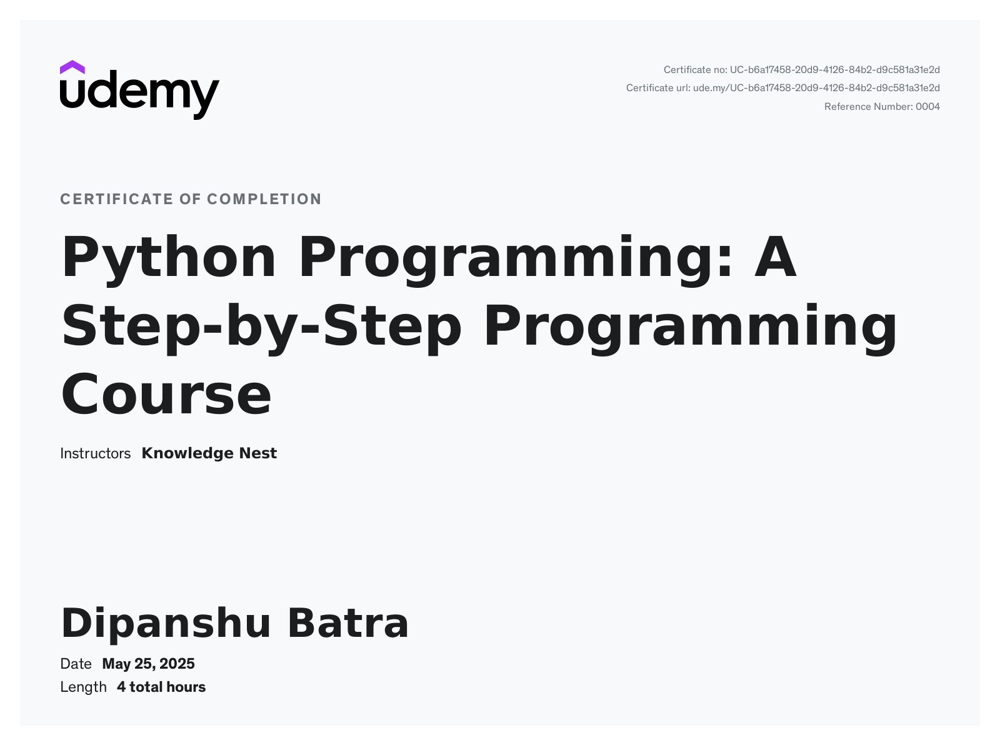
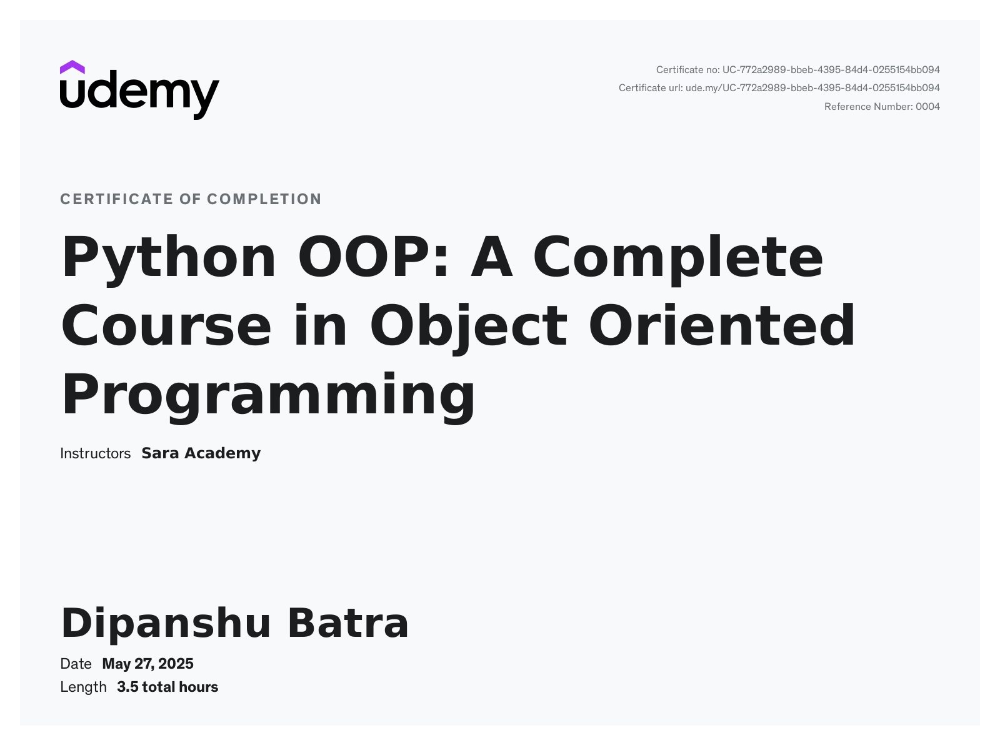
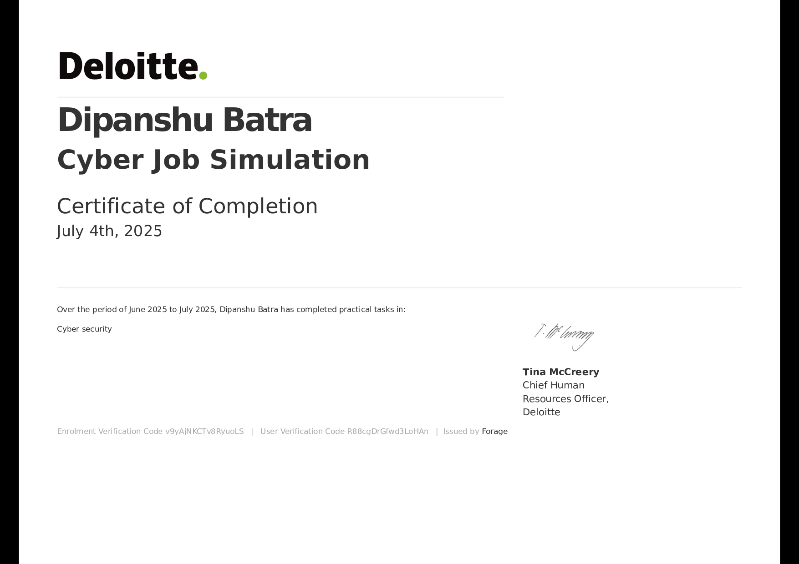
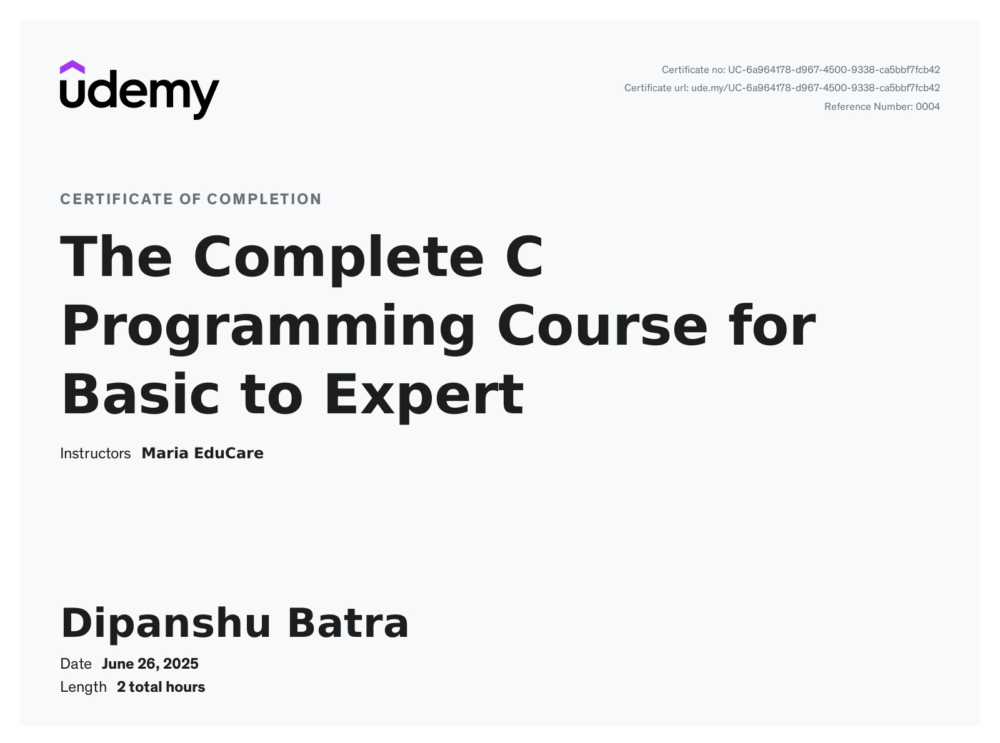
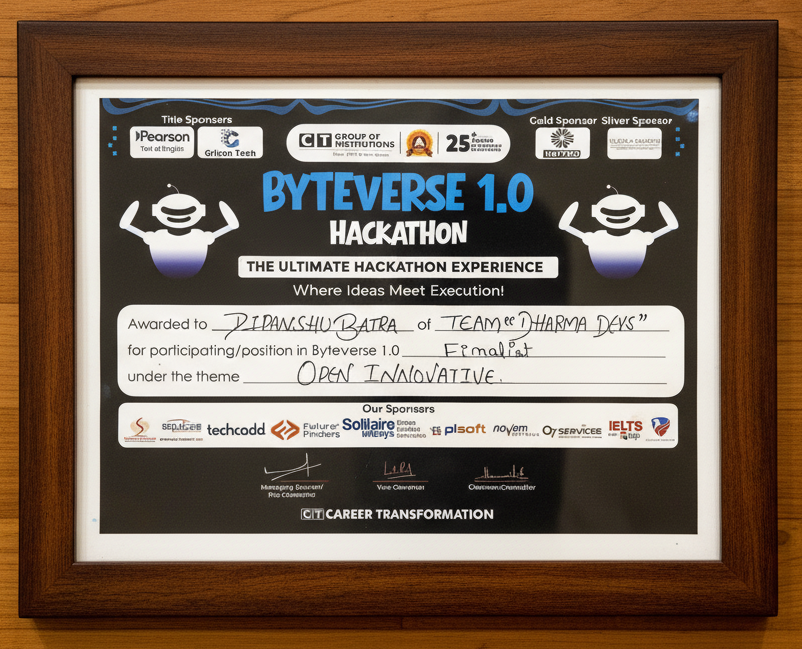

# 🎓 My Certifications & Achievements

## 1. Python Programming: A Step-by-Step Programming Course  
**📍 Platform:** Udemy  
**📝 Description:** Completed a comprehensive Python basics course focusing on programming fundamentals and syntax.  

📜 **Certificate:**  

---

## 2. Object-Oriented Programming in Python  
**📍 Platform:** Great Learning *(update if different)*  
**📝 Description:** Learned OOP concepts including classes, objects, inheritance, polymorphism, encapsulation, and abstraction.  

📜 **Certificate:**  

---

## 3. Deloitte Technology Consulting Virtual Internship  
**📍 Platform:** Forage  
**📝 Description:** Completed a virtual internship with Deloitte, working on business analysis, digital transformation, and tech solution recommendations.  

📜 **Certificate:**  

---

## 4. C Programming – Basic to Intermediate  
**📍 Platform:** Udemy  
**📝 Description:** Gained foundational skills in C programming including data types, control structures, arrays, pointers, and memory management.  

📜 **Certificate:**  

---

## 5. Byteverse 1.0 Hackathon Finalist  
**📍 Platform:** CT Group of Institutions  
**📝 Description:** Finalist in Byteverse 1.0 Hackathon (Open Innovation) with project *Hackathon Management System* as part of **Team Dharma Devs**.  

📜 **Certificate:**  

---

## 6. Participation Certificate  
**📝 Description:** General participation recognition.  

📜 **Certificate:**  

